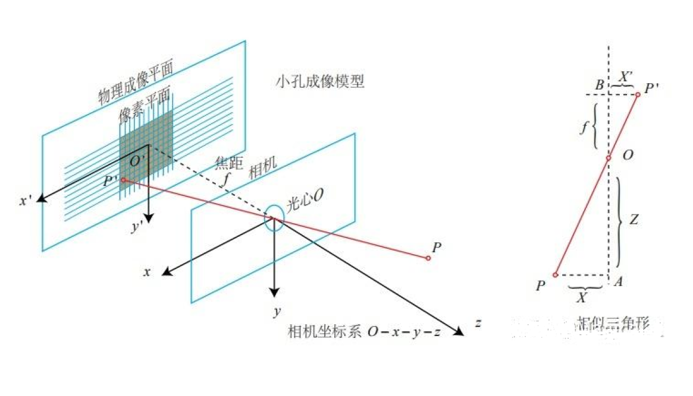
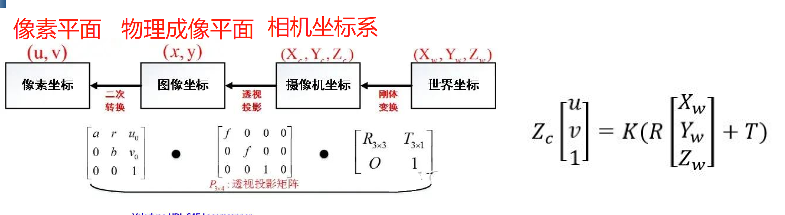

# Camera Model

## Pinhole 模型

### 相机内参

相机坐标系($x, y, z$): 右下前, 原点位于透镜光心 $O$ 位置。  
物理成像平面坐标系($x^{'}, y^{'}, z^{'}$)：右下(二维)，原点位于OCS坐标原点投影到物理成像平面的位置 $O_{'}$ 位置  
像素坐标系(u,v)：原点位于像素平面左上第一个点  

  

由相机坐标系一点 $p(x, y, z)$ 投影到物理成像平面 $p^{'} (x^{'}, y^{'}, z^{'})$ 后，由于相似三角形的原理可以知道投影关系如下：  
$$ 
\frac{f}{z} = -\frac{x^{'}}{x} = -\frac{y^{'}}{y} 
$$  

从物理平面到像素平面的转换关系如下：$p^{'} (x^{'}, y^{'}, z^{'})$ 单位是米，
$$
    u = \alpha x^{'} + c_x \\
    v = \beta y^{'} + c_y
$$

- $\alpha$: x方向像素每米  
- $\beta$: y方向像素每米  

联合相机坐标系到成像平面坐标系和成像平面坐标系到像素平面坐标系的公式后，得到相机坐标系到像素坐标系的关系：  
$$
    u = - \alpha f \frac{x}{z} + cx \\
    v = - \beta f \frac{y}{z} + cy
$$
令 $f_x = - \alpha f, f_y = - \beta f$后:
$$
    u = f_x \frac{x}{z} + c_x \\
    v = f_y \frac{y}{z} + c_y
$$
利用齐次坐标写成矩阵的形式：
$$
    \begin{pmatrix} u \\ v \\1 \end{pmatrix} = \frac{1}{z} \begin{pmatrix} f_x & 0 & c_x \\ 0 & fy & c_y \\ 0 & 0 & 1\end{pmatrix} \begin{pmatrix}  x \\ y \\ z\\ \end{pmatrix} = \frac{1}{Z}KP
$$
K 既为相机内参，用于相机坐标系到像素平面的转换。  

### 畸变参数

径向畸变：由于镜头的形状、光学元件和焦距等因素导致越图像边缘的部分出现越严重的偏差。  

径向畸变修正公式：
$$
    x_{corrected} = x + x(k_1 r^2 + k_2 r^4 + k_3 r^6) \\
    y_{corrected} = y + y(k_1 r^2 + k_2 r^4 + k_3 r^6)
$$

$k_1, k_2, k_3$: 径向畸变参数，$k_1, k_2, k_3$ 小于0时图像为桶形畸变，大于0时为枕形畸变  
$r$: 图像坐标到图像中心的距离($\sqrt{x^2 + y^2}$)单位是米，所以这个公式是要求像素或者相机坐标系的点转到归一化平面后使用这个去畸变的公式  

切向畸变：  
- 镜头的光轴与相机传感器的光轴没有完全对准。  
- 镜头和图像传感器的对准误差。  

切向畸变修正公式：
$$
    x_{corrected} = x + 2p_1 xy + p_2(r^2 + 2x^2) \\
    y_{corrected} = y + 2p_2 xy + p_1(r^2 + 2y^2)
$$

径向畸变和切向畸变修正联合公式如下：  
$$
    x_{corrected} = x + x(k_1 r^2 + k_2 r^4 + k_3 r^6) + 2p_1xy + p_2(r^2 + 2x^2) \\
    y_{corrected} = y + y(k_1 r^2 + k_2 r^4 + k_3 r^6) + 2p_2xy + p_1(r^1 + 2y^2)
$$

**注意：去畸变公式由于需要计算r(图像到图像中心的距离)，所以这里统一需要将坐标转到归一化平面后计算r后，再使用去畸变公式**  

### 相机外参

世界坐标系 -> 相机坐标系：相机外参标定  
相机坐标系 -> 成像平面坐标：焦距有关，内参的一部分  
成像平面坐标系 -> 像素坐标系：像素每米，内参的一部分  

$$
    Z_c \begin{pmatrix} u \\ v \\ 1 \end{pmatrix} = K(R \begin{pmatrix} X_w \\ Y_w \\ Z_w \end{pmatrix} + T)
$$

这里的R、T是世界坐标系和相机坐标系的转换关系，这就是外参。

### 相机标定

